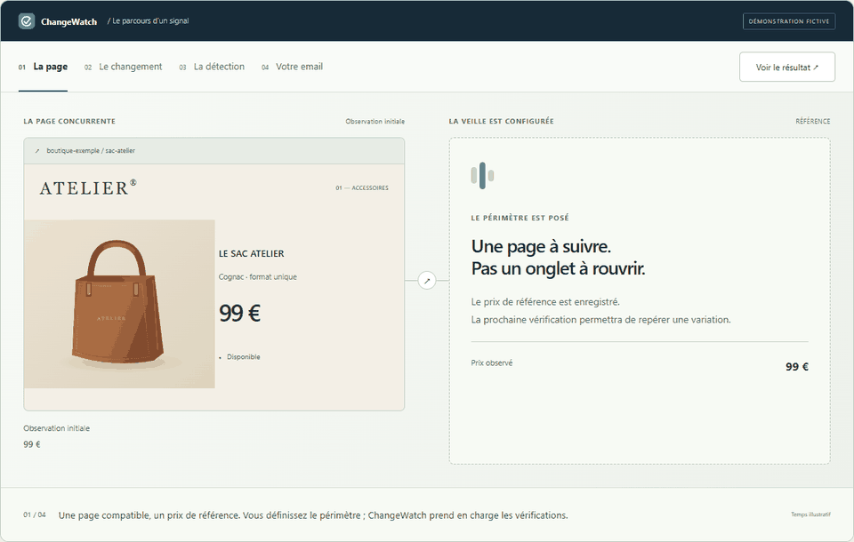

# Prototype : du changement au signal

Expérimentation du 16 septembre 2026 sur `codex/product-story-prototype`, à partir de `8b52fe9` (`codex/premium-redesign`, PR #1). La nouvelle PR cible cette branche de référence pour isoler le travail sur le hero et la démonstration. Les deux PR restent en brouillon, sans fusion ni publication sur `main`.

## Direction

Un premier écran bleu nuit, une accroche courte et une rupture typographique en italique. Le produit fictif est mis en scène dans sa boutique, puis sa variation se transforme en notification ChangeWatch. L’illustration du sac est un SVG original local : aucune photographie tierce, police distante ou bibliothèque d’animation.

La démonstration arrive immédiatement après le hero. Les anciens blocs d’audience et de problème, qui retardaient ce moment en répétant la promesse, sont retirés. Les quatre cartes sont remplacées par une scène partagée : la source reste à gauche et le résultat évolue à droite. Tarifs, formulaire, FAQ, blog et pages juridiques restent ceux du brouillon de référence.

L’interface de démonstration est explicitement illustrative ; elle ne promet pas un tableau de bord disponible. Toutes les valeurs, le produit et la boutique sont fictifs. La fréquence planifiée, les pages compatibles et les limites de couverture restent précisées.

## Deux passes visuelles

La première passe établissait le contraste nuit/crème, le duo typographique et le parcours page → email. La revue des captures a ensuite révélé deux problèmes : la source occupait trop de hauteur sur mobile, et les informations utiles de la démo étaient trop petites.

La seconde passe compacte la source mobile, augmente la taille des contenus de l’alerte, maintient les commandes à portée avec une position collante et réserve l’espace du panneau le plus haut pour éviter les sauts entre les états. L’ancien prix a aussi été assombri après un échec de contraste (4,49:1) lors de l’audit.

## Interactions

- Hero : entrée légère, changement 99 € → 79 €, passage de vérification, puis notification. Une seule lecture, terminée en moins de quatre secondes, sans boucle.
- Démo : première lecture automatique lorsque la scène entre dans la vue, sur 5,7 secondes. Pause/reprise et relecture explicites. La lecture s’arrête en quittant la scène ou en masquant l’onglet ; pas de reprise automatique surprise.
- Quatre commandes permettent d’examiner librement les états. Tab/Entrée sont natifs ; flèches gauche/droite, Début et Fin sélectionnent aussi une étape. Un déplacement du focus vers les étapes arrête la progression.
- Les annonces de statut restent silencieuses pendant la lecture automatique et deviennent polies après une action volontaire.
- `prefers-reduced-motion` : résultat final affiché immédiatement, aucune entrée, rotation, transition ou balayage animé ; étapes directement explorables. Un changement de préférence en cours de lecture annule les temporisateurs et affiche le résultat.
- Sans JavaScript : le hero et l’email final restent visibles ; explication textuelle du parcours. Aucun contenu commercial essentiel caché.

## Captures et séquence

Les captures de la démo montrent des états stabilisés avec mouvement réduit. Le GIF assemble ces captures : il explique les quatre états et ne représente pas la durée réelle d’une détection. Il est réservé à la documentation, jamais chargé par le site.

| Vue | Avant (PR #1) | Prototype |
| --- | --- | --- |
| Hero desktop | [Avant](../redesign/after-home-1440.webp) | [Après](hero-1440.webp) |
| Hero mobile | [Avant](../redesign/after-home-390.webp) | [Après](hero-390.webp) |
| Démo desktop | [Avant](../redesign/after-alertes.webp) | [Après](demo-1440.webp) |
| Démo mobile | [Ancienne page complète](../redesign/after-home-390-full.webp) | [Après](demo-390.webp) |

États desktop : [01 — Page](step-1-1440.webp), [02 — Changement](step-2-1440.webp), [03 — Détection](step-3-1440.webp), [04 — Email](step-4-1440.webp).

États mobile : [01](step-1-390.webp), [02](step-2-390.webp), [03](step-3-390.webp), [04](step-4-390.webp).

## Validation

- `node tests/browser.cjs` avec Playwright et Microsoft Edge : suite passée. Les trois liens Stripe, les prix, les CTA et leur ouverture dans le même onglet sont contrôlés exactement.
- Formspree/Turnstile simulés : jeton absent/blanc, succès, HTTP 422, panne réseau, délai, double soumission, conservation des champs et réinitialisation du widget. Aucun envoi ni paiement réel.
- Nouvelle séquence : fin du hero, lecture automatique, pause stable, reprise/relecture, sélection directe, clavier, changement de préférence de mouvement pendant une lecture.
- Les quatre états aux six largeurs 320, 375, 390, 768, 1024 et 1440 px : aucun débordement global. Sept pages recontrôlées ; liens locaux, images, ancres et SEO existant préservés. Texte à 200 % et mode sans JavaScript contrôlés.
- Axe-core 4.10.3 : aucune violation détectée sur les dix audits (hero et quatre états, à 390 et 1440 px). [Résultats](accessibility.json). Cela ne constitue pas une certification exhaustive.
- JavaScript et `git diff --check` contrôlés. `script.js`, `CNAME`, les pages juridiques, le blog et la section tarifaire restent inchangés par rapport à la branche de référence.
- Mesure exploratoire locale, dans des pages fraîches, sans ralentissement CPU/réseau et avec Turnstile bloqué : CLS du hero inférieur à 0,001. Ce n’est pas un score Lighthouse ni une mesure en production.
- CSS propre à l’accueil, JavaScript natif et SVG local ; aucune dépendance de production. Le script d’expérience reste inférieur à 6 ko bruts, l’illustration à 3 ko. Les captures et le GIF ne sont pas téléchargés par la page.

Pour reproduire : Node.js, Playwright et Edge, puis `node tests/browser.cjs`. Si Playwright est fourni par l’environnement, renseigner `PLAYWRIGHT_MODULE`. La suite utilise un serveur local temporaire sur le port 8765 et intercepte les services tiers.

## Revue humaine restante

Validation de la direction artistique par le propriétaire avant fusion. Vérification sur Safari/iOS, Firefox, téléphone physique et lecteur d’écran. Vérification du véritable widget Turnstile et des services Stripe/Formspree sur le domaine autorisé après une publication expressément approuvée. Aucun déploiement réalisé pour ce prototype.
